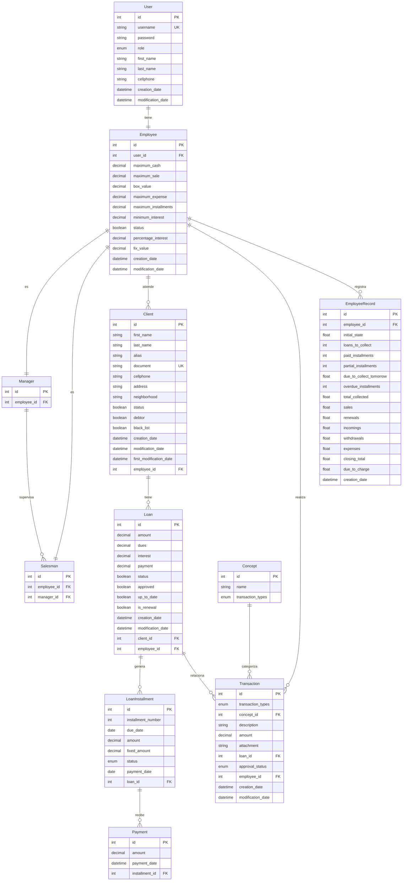

# Flask Prestamos

Sistema de gestión y control de préstamos desarrollado en Flask, con soporte para base de datos relacional y contenedorización mediante Docker.

---

## 📋 Tabla de Contenidos
1. [Requisitos e Instalación con Docker](#1-requisitos-e-instalación-con-docker)
2. [Migraciones y Configuración Inicial](#2-migraciones-y-configuración-inicial)
3. [Modelo de Base de Datos (ER)](#3-modelo-de-base-de-datos-er)
4. [Optimización de Base de Datos (Índices)](#4-optimización-de-base-de-datos-índices)
5. [Sistema de Caché (Opcional / Deshabilitado)](#5-sistema-de-caché-opcional--deshabilitado)
6. [Comandos Útiles y Solución de Problemas](#6-comandos-útiles-y-solución-de-problemas)

---

## 1. Requisitos e Instalación con Docker

Este proyecto se ejecuta en un entorno aislado utilizando Docker (Flask + MySQL) sin necesidad de herramientas locales como XAMPP.

### Requisitos
- Docker Desktop (o Docker Engine + Docker Compose plugin)

### Levantar el entorno
Desde la raíz del proyecto, ejecuta el siguiente comando:
```bash
docker compose up --build
```

### Servicios Levantados
- **`web`**: Aplicación Flask corriendo en modo desarrollo (`flask run --host=0.0.0.0 --port=5000`).
- **`db`**: Servidor MySQL con volumen persistente `mysql_data`.
- **`phpmyadmin`**: Administrador web para la base de datos MySQL.

### Acceso Web
- Aplicación: [http://localhost:5000](http://localhost:5000)
- phpMyAdmin: [http://localhost:8080](http://localhost:8080)

### Variables de Entorno (Opcional)
Si deseas personalizar credenciales o puertos, crea un archivo `.env` en la raíz del proyecto:
```env
MYSQL_DATABASE=wwrutz_chile
MYSQL_USER=prestamos_user
MYSQL_PASSWORD=prestamos_pass
MYSQL_ROOT_PASSWORD=root
DB_PORT_HOST=3307
FLASK_PORT=5000
PHPMYADMIN_PORT=8080
SECRET_KEY=dev-secret-key
FLASK_DEBUG=1
```
*Si no existe el archivo `.env`, Docker utilizará los valores definidos por defecto en `docker-compose.yml`.*

---

## 2. Migraciones y Configuración Inicial

### Inicializar y aplicar migraciones
Con los contenedores de Docker en ejecución, abre una terminal y ejecuta:
```bash
docker compose exec web flask db upgrade
```

Si es la primera vez que inicializas el proyecto y no existe la carpeta `migrations/`:
```bash
docker compose exec web flask db init
docker compose exec web flask db migrate
docker compose exec web flask db upgrade
```

### Crear usuario administrador por defecto
Abre una consola interactiva de Python dentro del contenedor web:
```bash
docker compose exec web python
```

Una vez dentro de Python, ejecuta el siguiente bloque de código:
```python
from app import create_app, db
import datetime
from sqlalchemy import text

app = create_app()
app.app_context().push()

stmt = text('''
    INSERT INTO User (username, password, role, first_name, last_name, cellphone, creation_date, modification_date)
    VALUES (:username, :password, :role, :first_name, :last_name, :cellphone, :creation_date, :modification_date)
''')

db.session.execute(stmt, {
    'username': 'admin',
    'password': '123456',
    'role': 'ADMINISTRADOR',
    'first_name': 'Andres',
    'last_name': 'Ramirez',
    'cellphone': '1234567890',
    'creation_date': datetime.datetime.utcnow(),
    'modification_date': datetime.datetime.utcnow()
})
db.session.commit()
```

---

## 3. Modelo de Base de Datos (ER)

### Enumeraciones del Sistema

- **Role (Roles de Usuario)**: `ADMINISTRADOR`, `COORDINADOR`, `VENDEDOR`.
- **InstallmentStatus (Estados de Cuota)**: `PENDIENTE`, `PAGADA`, `ABONADA`, `MORA`.
- **TransactionType (Tipos de Transacción)**: `GASTO`, `INGRESO`, `RETIRO`.
- **ApprovalStatus (Estados de Aprobación)**: `PENDIENTE`, `APROBADA`, `RECHAZADA`.

### Diagrama de Entidades y Relaciones (ERD)



### Descripción de Entidades
1. **User (Usuario)**: Datos base de inicio de sesión y rol asignado.
2. **Employee (Empleado)**: Parámetros del negocio asociados a un usuario (límites de dinero, tasa mínima, etc.).
3. **Manager (Coordinador)**: Tipo de empleado con subordinados.
4. **Salesman (Vendedor)**: Empleado que atiende clientes.
5. **Client (Cliente)**: Datos personales y estados (moroso, lista negra) de clientes.
6. **Loan (Préstamo)**: Datos financieros generales del préstamo.
7. **LoanInstallment (Cuota)**: Detalle del estado y fecha de pago por cada cuota de préstamo.
8. **Payment (Pago)**: Transacciones de abonos a las cuotas.
9. **Concept (Concepto)**: Categorización de transacciones financieras.
10. **Transaction (Transacción)**: Registro monetario general (Gastos, ingresos, retiros).
11. **EmployeeRecord (Registro diario)**: Balances e histórico de caja al cierre del día.

---

## 4. Optimización de Base de Datos (Índices)

Se han diseñado índices específicos para mejorar los tiempos de respuesta del endpoint `/box` (Fase 1 de optimización).

### Archivos de optimización incluidos
- **`optimize_box_endpoint.py`** (Recomendado): Ejecuta la creación de índices críticos mediante SQLAlchemy.
- **`create_database_indexes.py`**: Script completo con verificación detallada.
- **`database_indexes_optimization.sql`**: Sentencias SQL puras para su ejecución directa.

### Ejecución de Optimización (Recomendada)
Para crear los índices críticos desde Python:
```bash
python optimize_box_endpoint.py
```

### Índices Críticos creados
- `idx_transaction_employee_date_type_status` (employee_id, creation_date, transaction_types, approval_status)
- `idx_loan_employee_status` (employee_id, status)
- `idx_loan_installment_loan_status` (loan_id, status)
- `idx_payment_installment_date` (installment_id, payment_date)
- `idx_salesman_manager_id` (manager_id)
- `idx_client_employee_status` (employee_id, status)

---

## 5. Sistema de Caché (Opcional / Deshabilitado)

> [!NOTE]
> Estado Actual: El sistema de caché Redis se encuentra **comentado y deshabilitado** en producción en el archivo `app/routes.py` (las rutas correspondientes y la inicialización no interfieren en el flujo estándar).

### Estructura y Dependencias
Si se desea activar en el futuro, las dependencias y configuraciones se encuentran pre-definidas en:
- `cache_requirements.txt`
- `cache_config.py`
- `cache_init_example.py`

### Instalación rápida de caché
1. Instalar dependencias adicionales:
   ```bash
   pip install -r cache_requirements.txt
   ```
2. Instalar Redis local o mediante Docker:
   ```bash
   docker run -d -p 6379:6379 redis:alpine
   ```
3. Descomentar la inicialización en `app/__init__.py` y las configuraciones/decoradores `@safe_cache` en `app/routes.py`.

---

## 6. Comandos Útiles y Solución de Problemas

### Monitoreo de Logs en Docker
```bash
docker compose logs -f web
docker compose logs -f db
docker compose logs -f phpmyadmin
```

### Detener el entorno
```bash
docker compose down
```

### Reinicio Completo (Borrando volumen de base de datos)
```bash
docker compose down -v
```

### Solución a Puertos Ocupados
Si tienes conflictos con los puertos asignados por defecto, edita los siguientes valores en el archivo `.env`:
- `5000` (Flask): cambia `FLASK_PORT`.
- `3306`/`3307` (MySQL): cambia `DB_PORT_HOST`.
- `8080` (phpMyAdmin): cambia `PHPMYADMIN_PORT`.
