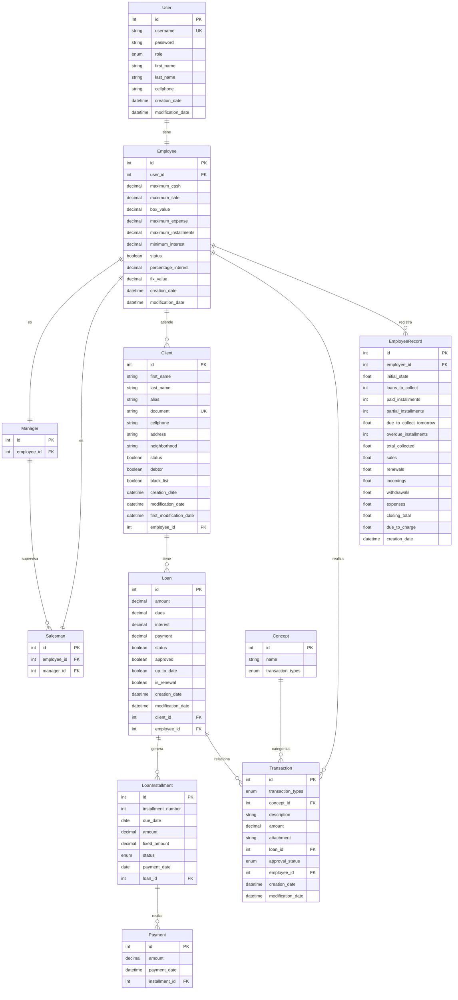

# Diagrama del Modelo de Base de Datos - Sistema de Préstamos

## Diagrama ER (Entity-Relationship)

### Enumeraciones del Sistema

**Role (Roles de Usuario):**
- ADMINISTRADOR
- COORDINADOR  
- VENDEDOR

**InstallmentStatus (Estados de Cuota):**
- PENDIENTE
- PAGADA
- ABONADA
- MORA

**TransactionType (Tipos de Transacción):**
- GASTO
- INGRESO
- RETIRO

**ApprovalStatus (Estados de Aprobación):**
- PENDIENTE
- APROBADA
- RECHAZADA

### Diagrama de Entidades y Relaciones

## Descripción de las Entidades

### 1. **User** (Usuario)
- Entidad base para todos los usuarios del sistema
- Contiene información personal y credenciales
- Se relaciona con Employee mediante una relación 1:1

### 2. **Employee** (Empleado)
- Extiende la información de User con parámetros de negocio
- Define límites y configuraciones para préstamos y caja
- Puede ser Manager o Salesman

### 3. **Manager** (Coordinador)
- Tipo especial de Employee que supervisa vendedores
- Tiene relación 1:N con Salesman

### 4. **Salesman** (Vendedor)
- Tipo especial de Employee que atiende clientes
- Está supervisado por un Manager

### 5. **Client** (Cliente)
- Información de los clientes del sistema
- Puede estar en lista negra o ser deudor
- Asignado a un Employee

### 6. **Loan** (Préstamo)
- Representa un préstamo otorgado a un cliente
- Contiene información financiera del préstamo
- Se relaciona con Client y Employee

### 7. **LoanInstallment** (Cuota)
- Representa cada cuota de un préstamo
- Tiene estados: PENDIENTE, PAGADA, ABONADA, MORA
- Se relaciona con Loan y Payment

### 8. **Payment** (Pago)
- Registra los pagos realizados a las cuotas
- Se relaciona con LoanInstallment

### 9. **Concept** (Concepto)
- Categorías para las transacciones
- Define tipos: GASTO, INGRESO, RETIRO

### 10. **Transaction** (Transacción)
- Registra movimientos financieros
- Puede estar relacionada con un préstamo
- Requiere aprobación (PENDIENTE, APROBADA, RECHAZADA)

### 11. **EmployeeRecord** (Registro de Empleado)
- Registro diario del estado de caja del empleado
- Contiene estadísticas y balances

## Características del Modelo

- **Normalización**: El modelo está bien normalizado con separación clara de responsabilidades
- **Integridad Referencial**: Todas las relaciones están correctamente definidas con claves foráneas
- **Auditoría**: Incluye campos de creación y modificación para trazabilidad
- **Estados**: Maneja estados para préstamos, cuotas y transacciones
- **Jerarquía**: Implementa jerarquía de roles (Manager > Salesman)
- **Flexibilidad**: Permite diferentes tipos de transacciones y conceptos

## Flujo de Datos

1. **Gestión de Usuarios**: User → Employee → Manager/Salesman
2. **Gestión de Clientes**: Salesman → Client
3. **Proceso de Préstamos**: Client → Loan → LoanInstallment → Payment
4. **Transacciones Financieras**: Employee → Transaction → Concept
5. **Control de Caja**: Employee → EmployeeRecord 